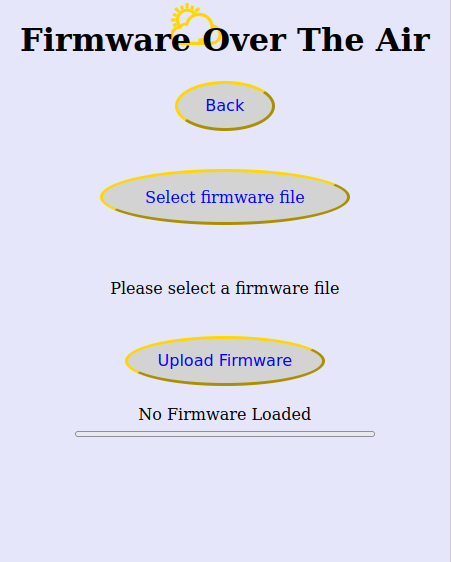
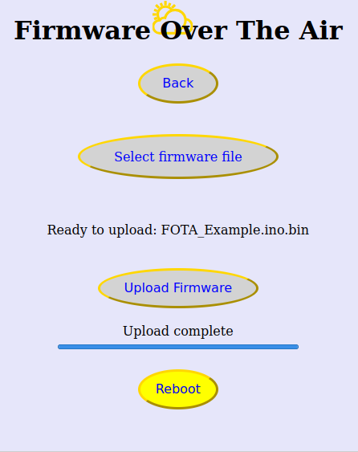
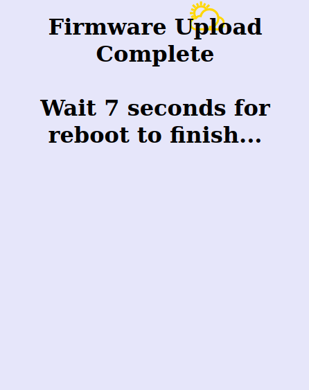

# Firmware Over The Air

Use this free customizable 'Firmware Over The Air' utility to upload sketches remotely to ESP8266/ESP32.

## License

This project is licensed under the terms of the Unlicense.
 For more details, please refer to [UNLICENSE.md](UNLICENSE.md).
 For more information, please refer to <http://unlicense.org>.

## How to use this

First upload is via USB of course but later you do not need the USB anymore.

<table border = 1 bordercolor ="red" align = center>
<tr>
<td>

</td>
<td>

</td>
<td>

</td>
<td>

</td>
</tr>
</table>

All you need to do is :

- Copy FOTA.ino and the 'h-files' in your Arduino IDE project.
- Include 1 'h-file' in FOTA.ino

- For your main app :

  Use the library manager to install some libraries. 
  Install 'ESP Async WebServer' by Me-No-Dev.
  For the ESP8266 install 'ESPAsyncTCP' by dvarrelInstall and for the ESP32 
  install 'Async TCP' by Me-No_Dev (Mathieu Carbou) Note the spaces in the names 'Async TCP' and 'ESP Async WebServer'

  After creating your webserver named MyWebServer with:
     String User = "admin";
     String Password = "admin";
     AsyncWebServer MyWebServer(80);

  call:
     FOTAConfigureWebServer(MyWebServer,User,Password); 

  and you can browse to http://'ipadress'/FOTA/FOTA

  In Arduino IDE use 'Sketch > Export Compiled Binary' to create a bin file in your project folder.

  Click the button to select the bin file, click the button to upload, wait and click reboot.

You may compile and upload FOTA_Example and use that to upload any 'Exported Compiled Binary'.

To test you could change the include in FOTA.ino, create an export and upload that.

I hope you like this and when you have suggestions, please let me know.. 