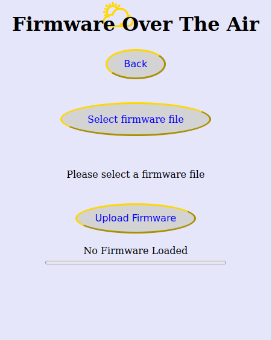
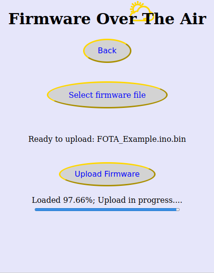
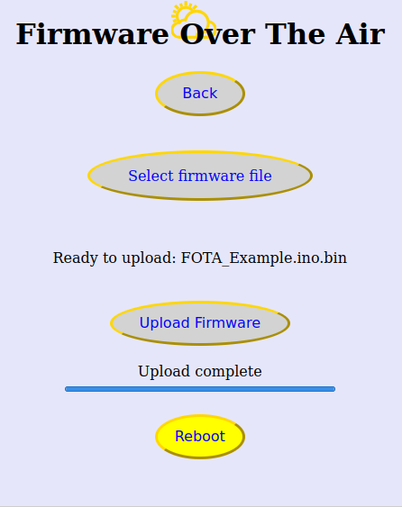
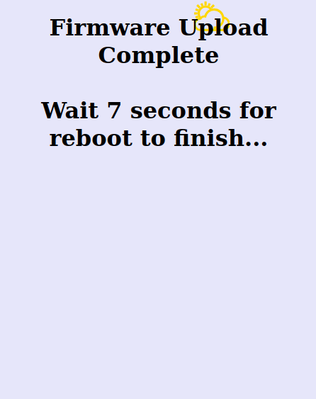

# Firmware Over The Air

Use this free customizable 'Firmware Over The Air' utility to upload sketches remotely to ESP8266/ESP32.

## License

This project is licensed under the terms of the Unlicense.
 For more details, please refer to [UNLICENSE.md](UNLICENSE.md).
 For more information, please refer to <http://unlicense.org>.

## Example

I put everything in the subdirectory FOTA_Example so you can copy that folder as a project in your Arduino IDE projects folder and use it.

There is a more detailed readme in that folder and also some examples for the GUI.

Want your own GUI ? Make a copy of an existing one and tweek it.

This are screenshots of the one I like :

<table border = 1 bordercolor ="red" align = center>
<tr>
<td>

</td>
<td>

</td>
</tr>
<tr>
<td>

</td>
<td>

</td>
</tr>
</table>
